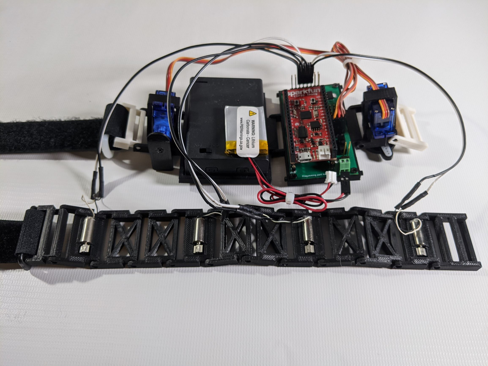

<!-- 

  

 -->
# Welcome to Snaptics

## What is Snaptics
Snaptics is an open source, low cost, haptics platform designed for rapid prototyping of fully wearable multi-sensory haptic devices. 
Snaptics uses modular framework allowing designers to quickly test and replace snaptic modules as desired.
All modules are designed to be assembled using 3D printed components and cheap off-the-shelf actuators to minimize costs to the designer. 

## Why Snaptics
Our platform exists to increase community engagement with and accessibility of wearable haptic devices by lowering the technical barrier to entry and cost of creating a wearable haptic device.
With snaptics you can quickly and easily build a simple wearable haptic device to integrate into your desired project for under $100.

## Where to Start
- For step-by-step guides on how to get started with Snaptics see our Tutorials Page
- For information about what modules are currently available see our Hardware Page
- For Snaptics 3D models see our Downloads Page
- For other questions please see our FAQ Page or contact us at info@snaptics.org
- For Snaptics license and publication information see our About Us Page

### Please note this site is under construction. 