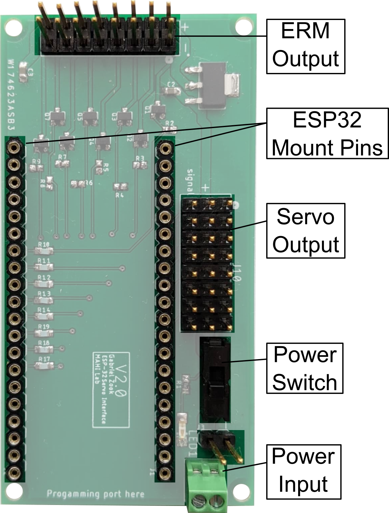
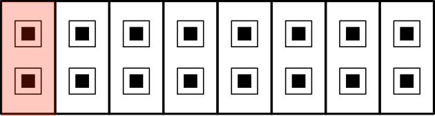
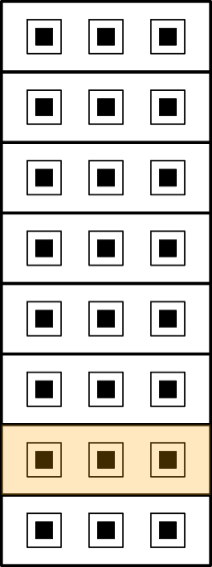

## Snaptics Electronics Overview

The Snaptics control board is an expansion board for a Sparkfun ESP32 Microcontroller to allow the ESP32 to safely and simply control the electronics used in various Snaptics actuation modules. For information on the ESP32 microcontroller please visit their product page [here](https://www.sparkfun.com/products/13907).

  

The Snaptics PCB board provides mounting pins to attach to a [Sparkfun ESP32 Development Board](https://www.sparkfun.com/products/13907). With the ESP32 as the controller this board allows makers to control up to 8 vibration motors using the ERM output pins and 8 servo motors using the Servo output pins at a time. Servo output pins connect directly into the ESP32 PWM output pins and to motor power while ERM output pins are controlled with a simple onboard MOSFET circuit to simplify the control on the microcontroller. The control board is powered with 6V operating power pack to provide power to the actuation modules. ESP32 power is provided directly to the board using a separate power supply of operating range 2.2V to 3.6V. 

## How to Get a Snaptics Control Board

All documentation and files required for the reproduction of these electronics board are provided below. We recommend outsourcing these boards for production and turnkey assembly to make the process as simple and cheap as possible. The files have been formatted so that you can upload or send them directly to your favorite board house. Need a recommendation? We have used US-based manufacturers such as [Sunstone Circuits](https://www.sunstone.com/) for basic PCB printing, and both [Sierra Circuits](https://www.protoexpress.com/) and [Screaming Circuits](https://www.screamingcircuits.com/) for turn-key printing and assembly with great results. More economical options are available from Chinese manufacturers such as [PCBWay](https://www.pcbway.com/). 

All designs are licensed under the TAPR Open Hardware License. Feel free to modify and/or redistribute the board designs within the confines of the license, but understand that we are not liable for any damage or harm the amplifier may cause to you or your equipment. It is your responsibility to safely integrate the amplifier with your projects.

|**Board Version**|**Description**|**Downloads**|
|:-----:|:-----|:-----:|
| V3.0 | Basic ESP32 Control Board | [ESP32 Control Schematic v3.zip](https://github.com/mahilab/Snaptics/blob/main/ESP32%20Control%20Schematic%20v3.zip) |

## Pin Assignments

### ERM Output Pins

|**Output Pin   Location**|**Associated   ESP32 Pin**|
|:-----:|:-----:|
|| 34 |
|| 35 |
|| 25 |
|| 26 |
|| 27 |
|| 14 |
|| 12 |
|| 13 |

### Servo Output Pins

|**Output Pin   Location**|**Associated   ESP32 Pin**|
|:-----:|:-----:|
|| 18 |
|| 5 |
|| 15 |
|| 2 |
|| 0 |
|| 4 |
|| 17 |
|| 16 |

